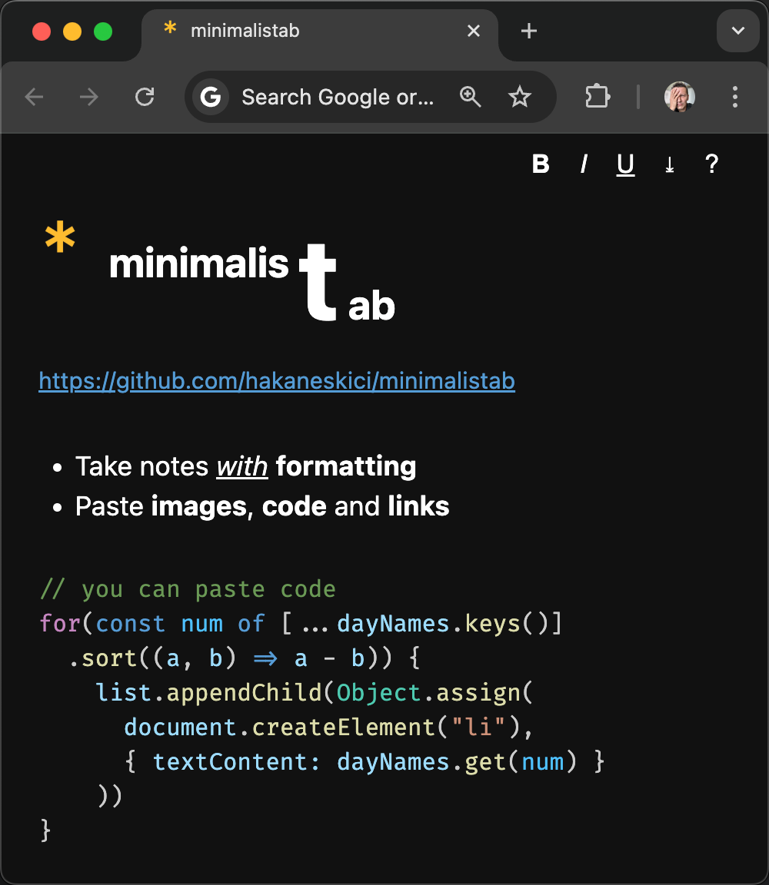
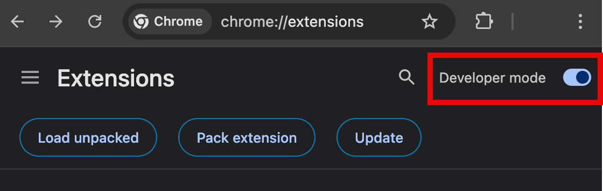
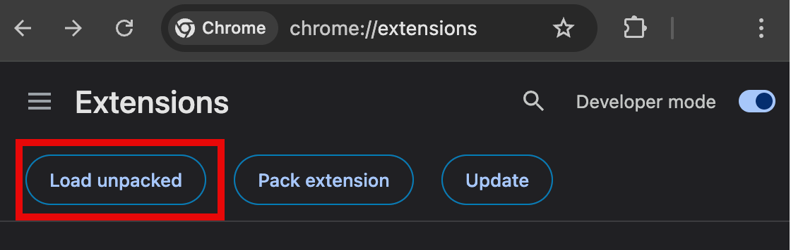

# README

## Minimalist WYSIWYG notes for Chrome New Tab

`minimalistab` is a minimalist New Tab extension for Chrome that replaces `chrome://newtab` view with a blank WYSIWYG editor to take notes.

Live DEMO -https://hakaneskici.github.io/minimalistab/minimalistab.html

- Take notes with <b><u><i>formatting</i></u></b>
- Use CMD/CTRL + {B, I, U} or <b>toolbar</b>
- Works <b>offline</b> by design
- Auto save to <b>local</b> storage
- Download as .<b>html</b> file
- <b>Dark/light</b> system theme
- Paste <b>images</b> and <b>links</b>
- <b>Plain JS</b>, no dependencies
- Works <i>without</i> JS too (no save)

## How to install

Not yet published to Chrome Store, so use this workaround:

1. Clone this repository:

`git clone https://github.com/hakaneskici/minimalistab.git`

1. Open Chrome Extensions page:

Go to `...` menu > `Extensions` > `Manage Extensions` or [chrome://extensions/](chrome://extensions/).

1. Enable `Developer Mode` on top right.

1. Select `Load unpacked` near top left.

1. Then, select the directory you cloned this repository to.

1. Your extension is ready to use, just open a new tab and start taking notes.

You will get a warning about your home page changing. Select "keep it" to approve the change, you can revert later.

## How to restore the original new tab view?

Just remove the extension from Chrome:

1. Go to `...` menu > `Extensions` > `Manage Extensions` or [chrome://extensions/](chrome://extensions/).

2. Select `Remove` for minimalistab extension.

3. New tab should display the default view now.

## How to personalize

Edit your local `minimalistab.html` and `minimalistab.js` files and refresh the "new tab" page to see your changes. Use F12 to debug.

## Feedback

Enjoy, and share your feedback at:
https://github.com/hakaneskici/minimalistab/issues
